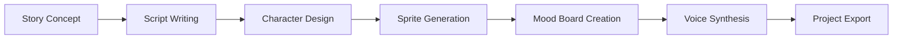

# Portfolio Applications Analysis Report

## Current Application Status

### 🔗 GitHub Repository Connections

| Application | Repository | Status |
|-------------|-----------|---------|
| **Chord Genesis** | `https://github.com/yetog/chord-genesis.git` | ✅ Connected |
| **DJ Visualizer** | `https://github.com/yetog/apr.git` | ✅ Connected |
| **Fineline** | `https://github.com/yetog/fineline.git` | ✅ Connected |
| **Game Hub** | `https://github.com/yetog/playful-space-arcade.git` | ✅ Connected |
| **Knowledge Base** | `https://github.com/yetog/knowledge-base.git` | ✅ Connected |
| **SpriteGen** | `https://github.com/yetog/spritegen.git` | ✅ Connected |
| **Voice Assistant** | `git@github.com:yetog/voice-agent-11.git` | ✅ Connected (SSH) |
| **Zen Reset** | `https://github.com/yetog/zen-reset-123.git` | ✅ Connected |

### ⚡ GitHub Actions Status

| Application | CI/CD Status | Actions Required |
|-------------|-------------|------------------|
| **All Apps** | ❌ No Actions | Need automated deployment workflows |

**Critical Issue**: None of the applications have GitHub Actions configured for:
- Automated testing
- Build verification
- Deployment automation
- Code quality checks

### 📊 SEO and Branding Status

| Application | Title | Meta Description | Favicon | Status |
|-------------|-------|-----------------|---------|---------|
| **Chord Genesis** | Basic | ❌ Missing | ⚠️ Default | Needs SEO |
| **DJ Visualizer** | Basic | ❌ Missing | ⚠️ Default | Needs SEO |
| **Fineline** | Basic | ❌ Missing | ⚠️ Default | Needs SEO |
| **Game Hub** | Basic | ❌ Missing | ⚠️ Default | Needs SEO |
| **SpriteGen** | Basic | ❌ Missing | ⚠️ Default | Needs SEO |
| **Voice Assistant** | Basic | ❌ Missing | ⚠️ Default | Needs SEO |
| **Zen Reset** | ✅ Good | ✅ Good | ✅ Custom | Well optimized |

## 🎯 SpriteForge Analysis

### Current Implementation
- **Technology**: React + TypeScript frontend, Flask + Python backend
- **Database**: MongoDB with sprite storage and rating system
- **AI Integration**: IONOS AI Hub for sprite generation
- **Features**: 
  - Sprite generation with prompts
  - Gallery with rating system
  - Training data upload
  - MCP (Model Context Protocol) integration

### Enhancement Opportunities
1. **Knowledge Base Integration**: Connect with existing knowledge base
2. **Content Creation Pipeline**: Script writing + mood boards + sprite generation
3. **API Integrations**: ElevenLabs TTS, Gamma mood board generation
4. **Workflow Automation**: End-to-end content creation pipeline

## 🚀 Proposed Enhanced Application: "Content Forge"

### Vision
A comprehensive content creation platform combining:
- **SpriteForge** (character/sprite generation)
- **Script Assistant** (story writing with knowledge base)
- **Mood Board Generator** (visual style guides)
- **Voice Synthesis** (character voice generation)
- **Project Management** (organizing creative projects)

### Technology Stack
```typescript
Frontend: React + TypeScript + Tailwind CSS
Backend: Flask/FastAPI + Python
Database: MongoDB + Vector DB for knowledge base
AI APIs: 
  - IONOS AI Hub (sprite generation)
  - ElevenLabs (text-to-speech)
  - Gamma API (mood board generation)
  - OpenAI/Anthropic (script assistance)
```

### Key Features

#### 1. Unified Project Dashboard
- Project overview with progress tracking
- Asset management (sprites, audio, mood boards)
- Timeline view for project milestones

#### 2. Enhanced Knowledge Base Integration
- **GitHub Directory Sync**: Auto-sync with knowledge base repos
- **Folder Upload**: Batch upload creative assets and notes
- **Vector Search**: Semantic search through project knowledge
- **Context Awareness**: AI assistants understand project context

#### 3. Content Creation Pipeline


#### 4. API Integrations

**ElevenLabs Integration:**
- Character voice generation
- Script narration
- Custom voice cloning for characters
- Audio export in multiple formats

**Gamma API Integration:**
- Automated mood board generation from scripts
- Style guide creation
- Visual theme suggestions
- Color palette generation

#### 5. Advanced Features
- **Collaborative Editing**: Multi-user project collaboration
- **Version Control**: Track changes across all assets
- **Export Templates**: Game engine integrations (Unity, Godot)
- **API Webhooks**: Connect with external tools

## 📋 Implementation Priority

### Phase 1: Foundation (Week 1-2)
1. ✅ Set up GitHub Actions for all apps
2. ✅ Implement SEO improvements across all apps
3. ✅ Create unified branding and favicons
4. ✅ Enhance SpriteForge with knowledge base connection

### Phase 2: Core Features (Week 3-4)
1. 🔄 Integrate ElevenLabs API for voice synthesis
2. 🔄 Add Gamma API for mood board generation
3. 🔄 Implement GitHub directory sync for knowledge base
4. 🔄 Create unified project dashboard

### Phase 3: Advanced Features (Week 5-6)
1. 🔄 Add collaborative features
2. 🔄 Implement export templates
3. 🔄 Create content creation pipeline automation
4. 🔄 Add portfolio integration

## 🛠️ Required Actions

### Immediate (Today)
- [ ] Create GitHub Actions workflows for all 8 applications
- [ ] Implement SEO metadata for all apps
- [ ] Design and add custom favicons/branding
- [ ] Update portfolio to showcase enhanced apps

### Short Term (This Week)
- [ ] Clone and analyze Wolf v2 BU repository
- [ ] Design Content Forge architecture
- [ ] Set up ElevenLabs and Gamma API integrations
- [ ] Create knowledge base sync functionality

### Medium Term (Next Week)
- [ ] Build unified dashboard interface
- [ ] Implement content creation pipeline
- [ ] Add collaborative features
- [ ] Create comprehensive documentation

## 📊 Expected Outcomes

### Technical Benefits
- **Automated Deployments**: Reduce manual deployment errors
- **Quality Assurance**: Automated testing and code quality checks
- **SEO Performance**: Improved search engine visibility
- **Brand Consistency**: Professional appearance across all apps

### Business Benefits
- **User Experience**: Seamless workflow for content creators
- **Market Position**: Comprehensive content creation platform
- **Scalability**: Modular architecture for easy expansion
- **Integration**: Connect with existing creative tools and workflows

## 🎯 Success Metrics

- **Performance**: All apps load <2 seconds
- **SEO**: All apps have 90+ SEO scores
- **Automation**: 100% deployment automation
- **User Engagement**: Integrated workflow reduces creation time by 60%
- **Quality**: Zero deployment failures with automated testing

---

*Report generated: October 20, 2025*
*Status: Ready for implementation*