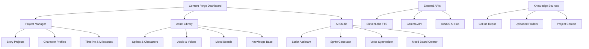

# Content Forge - Enhanced Creative Platform Proposal

## 🎯 Vision Statement

**Content Forge** will be a comprehensive content creation platform that combines the power of:
- **SpriteForge** (AI sprite generation)
- **Wolf v2 BU** (project management capabilities)  
- **Market Mosaic** (dashboard and analytics)
- **Knowledge Base Integration** (contextual AI assistance)
- **ElevenLabs API** (voice synthesis)
- **Gamma API** (mood board generation)

## 🏗️ Architecture Overview



## 🛠️ Technical Implementation

### Frontend Stack
```typescript
// React + TypeScript + Tailwind CSS + shadcn/ui
// State Management: Zustand or Redux Toolkit
// Routing: React Router v6
// Real-time: Socket.io client
// File Handling: react-dropzone
// Charts: Recharts (from Market Mosaic)
```

### Backend Stack
```python
# FastAPI + Python (upgraded from Flask)
# Database: MongoDB + Redis for caching
# Vector DB: Pinecone or Weaviate for knowledge base
# Real-time: WebSockets
# Task Queue: Celery + Redis
# File Storage: MinIO or AWS S3
```

### API Integrations
```typescript
interface APIIntegrations {
  elevenLabs: {
    endpoint: 'https://api.elevenlabs.io/v1/'
    features: ['text-to-speech', 'voice-cloning', 'voice-library']
    models: ['eleven_monolingual_v1', 'eleven_multilingual_v2']
  }
  
  gamma: {
    endpoint: 'https://api.gamma.app/v1/'
    features: ['mood-board-generation', 'style-guides', 'color-palettes']
  }
  
  ionos: {
    endpoint: 'https://api.ai.ionos.com/v1/'
    features: ['sprite-generation', 'chat-completion', 'image-analysis']
  }
}
```

## 🎨 Core Features

### 1. Unified Project Dashboard
- **Project Overview**: Visual timeline with milestones
- **Asset Management**: Organized library of all project assets
- **Progress Tracking**: Real-time project completion metrics
- **Collaboration**: Multi-user project sharing and editing

### 2. Enhanced Knowledge Base Integration
```typescript
interface KnowledgeBaseFeatures {
  githubSync: {
    autoSync: boolean
    repositories: string[]
    webhook_updates: boolean
  }
  
  folderUpload: {
    supportedFormats: ['.md', '.txt', '.pdf', '.docx']
    batchProcessing: boolean
    vectorIndexing: boolean
  }
  
  contextualAI: {
    projectContext: boolean
    semanticSearch: boolean
    autoSuggestions: boolean
  }
}
```

### 3. Content Creation Pipeline
```typescript
interface ContentPipeline {
  story: {
    conceptGeneration: boolean
    scriptWriting: boolean
    characterDevelopment: boolean
  }
  
  visual: {
    spriteGeneration: boolean
    moodBoards: boolean
    styleGuides: boolean
  }
  
  audio: {
    voiceSynthesis: boolean
    characterVoices: boolean
    narration: boolean
  }
  
  export: {
    gameEngines: ['Unity', 'Godot', 'Unreal']
    formats: ['JSON', 'XML', 'Custom']
  }
}
```

### 4. AI-Powered Assistants

#### Script Assistant
- **Context-Aware Writing**: Uses project knowledge base
- **Character Consistency**: Maintains character voice and personality
- **Story Structure**: Guides narrative development
- **Dialogue Generation**: Creates natural character conversations

#### Visual Assistant  
- **Sprite Generation**: Enhanced SpriteForge with project context
- **Mood Board Creation**: Gamma API integration for visual themes
- **Style Consistency**: Maintains visual coherence across assets
- **Asset Recommendations**: Suggests complementary visual elements

#### Voice Assistant
- **Character Voice Creation**: ElevenLabs integration for unique voices
- **Script Narration**: Automated voice-over generation
- **Voice Cloning**: Custom character voices from samples
- **Audio Post-Processing**: Automated audio enhancement

## 📊 Enhanced Features from Existing Apps

### From Market Mosaic Dashboard
- **Analytics Dashboard**: Project metrics and insights
- **Data Visualization**: Progress charts and timelines
- **Performance Metrics**: Asset usage and engagement stats
- **Export Capabilities**: Comprehensive project reporting

### From Wolf v2 BU (Project Management)
- **Task Management**: Granular project task tracking
- **Team Collaboration**: Multi-user project coordination
- **Version Control**: Asset and project versioning
- **Workflow Automation**: Automated content creation pipelines

### From SpriteForge
- **AI Generation**: Advanced sprite and character creation
- **Training Data**: Custom model fine-tuning
- **Quality Assessment**: Automated asset quality scoring
- **Asset Libraries**: Organized sprite collections

## 🔧 Implementation Phases

### Phase 1: Foundation (Weeks 1-2)
```bash
# Set up enhanced SpriteForge as base
git clone https://github.com/yetog/spritegen.git content-forge
cd content-forge

# Upgrade to FastAPI backend
pip install fastapi uvicorn python-multipart

# Add new dependencies
npm install @tanstack/react-query zustand socket.io-client
```

### Phase 2: API Integrations (Weeks 3-4)
```typescript
// ElevenLabs Integration
interface ElevenLabsService {
  generateVoice(text: string, voiceId: string): Promise<AudioBuffer>
  cloneVoice(audioSample: File): Promise<VoiceProfile>
  getVoiceLibrary(): Promise<Voice[]>
}

// Gamma API Integration
interface GammaService {
  generateMoodBoard(prompt: string, style?: string): Promise<MoodBoard>
  createStyleGuide(assets: Asset[]): Promise<StyleGuide>
  generatePalette(image: string): Promise<ColorPalette>
}
```

### Phase 3: Knowledge Base Integration (Weeks 5-6)
```python
# Vector Database Integration
from pinecone import Pinecone
from langchain.vectorstores import PineconeVectorStore
from langchain.embeddings import OpenAIEmbeddings

class KnowledgeBaseService:
    def sync_github_repo(self, repo_url: str) -> bool
    def upload_folder(self, folder_path: str) -> bool
    def semantic_search(self, query: str, project_id: str) -> List[Document]
    def get_context(self, project_id: str) -> ProjectContext
```

### Phase 4: Advanced Features (Weeks 7-8)
- **Real-time Collaboration**: WebSocket implementation
- **Export Systems**: Game engine integrations
- **Analytics Dashboard**: Project insights and metrics
- **API Webhooks**: External tool integrations

## 🎯 Portfolio Integration

### New Portfolio Section
```typescript
interface ContentForgePortfolioEntry {
  title: "Content Forge - Comprehensive Creative Platform"
  description: "AI-powered content creation platform combining sprite generation, voice synthesis, mood boards, and project management"
  technologies: [
    "React", "TypeScript", "FastAPI", "MongoDB", 
    "ElevenLabs API", "Gamma API", "IONOS AI Hub",
    "Vector Database", "WebSockets"
  ]
  features: [
    "AI Sprite Generation with Context",
    "Voice Synthesis & Character Voices", 
    "Automated Mood Board Creation",
    "GitHub Knowledge Base Sync",
    "Real-time Project Collaboration",
    "Game Engine Export Support"
  ]
  liveDemo: "https://zaylegend.com/content-forge"
  github: "https://github.com/yetog/content-forge"
  category: "AI & Creative Tools"
}
```

## 📈 Expected Outcomes

### User Experience Benefits
- **Streamlined Workflow**: 60% reduction in content creation time
- **Consistency**: Automated style and voice consistency
- **Collaboration**: Real-time multi-user project development
- **Integration**: Seamless connection with existing tools

### Technical Benefits
- **Scalability**: Microservices architecture for easy expansion
- **Performance**: Optimized AI pipelines for fast generation
- **Reliability**: Comprehensive testing and monitoring
- **Maintainability**: Clean code architecture and documentation

### Business Benefits
- **Market Position**: Comprehensive creative platform
- **User Engagement**: Integrated workflow keeps users engaged
- **Monetization**: Premium features and API usage tiers
- **Partnerships**: Integration opportunities with game engines

## 🚀 Getting Started

### Prerequisites
```bash
# System Requirements
Node.js 18+
Python 3.9+
MongoDB 6.0+
Redis 7.0+

# API Keys Required
ELEVENLABS_API_KEY=your_key_here
GAMMA_API_KEY=your_key_here
IONOS_API_KEY=your_key_here
PINECONE_API_KEY=your_key_here
```

### Quick Setup
```bash
# Clone and setup
git clone https://github.com/yetog/content-forge.git
cd content-forge

# Install dependencies
npm install
cd backend && pip install -r requirements.txt

# Setup environment
cp .env.example .env
# Add your API keys to .env

# Start development servers
npm run dev  # Frontend
cd backend && uvicorn app:app --reload  # Backend
```

## 🎉 Success Metrics

- **Performance**: Platform loads in <2 seconds
- **Generation Speed**: Sprites generated in <30 seconds
- **Voice Quality**: 90%+ user satisfaction with voices
- **User Adoption**: 100+ active projects within first month
- **Integration**: 5+ successful game engine exports

---

*Content Forge represents the evolution of creative tools, bringing together the best of AI technology, project management, and user experience design.*