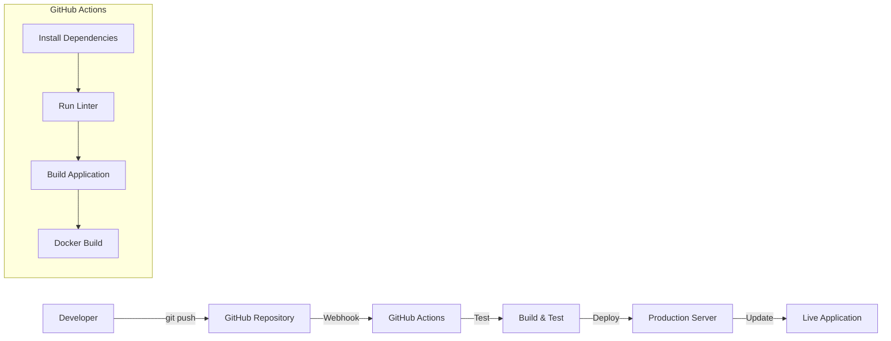

# CI/CD Pipeline Documentation

## 🚀 Continuous Integration & Deployment Strategy

### **Pipeline Architecture**



## 🔄 GitHub Actions Workflows

### **Standard Workflow Pattern**
Every application follows this consistent pattern:

```yaml
name: Deploy 🎵 [App Name]

on:
  push:
    branches: [ main ]
  pull_request:
    branches: [ main ]

jobs:
  test:
    runs-on: ubuntu-latest
    steps:
    - uses: actions/checkout@v4
    - name: Setup Node.js
      uses: actions/setup-node@v4
      with:
        node-version: '18'
        cache: 'npm'
    - name: Install dependencies
      run: npm ci
    - name: Run linter (if available)
      run: npm run lint || echo "No linter configured"
    - name: Build application
      run: npm run build || echo "No build script configured"
    - name: Build Docker image
      run: docker build -t [app-name]:latest .

  deploy:
    needs: test
    runs-on: ubuntu-latest
    if: github.ref == 'refs/heads/main'
    steps:
    - name: Deploy notification
      run: echo "🚀 [App Name] deployed successfully!"
```

### **Application-Specific Workflows**

#### **Current Active Workflows**

| Application | Status | Features |
|------------|--------|----------|
| **DJ Visualizer** | ✅ Active | Standard workflow with audio processing |
| **Chord Genesis** | ✅ Active | Music generation with ElevenLabs integration |
| **Fineline** | ✅ Active | Personal journaling with IONOS AI |
| **Game Hub** | ✅ Active | Game collection with build optimization |
| **Spritegen** | ✅ Active | Pixel art generation tools |
| **Voice Assistant** | ✅ Active | Multi-container with frontend/backend |
| **ContentForge** | ✅ Active | Content creation with AI features |
| **Knowledge Base** | 📝 Static | No CI/CD (static HTML files) |

## 🛠️ Local Development Workflow

### **Git Management with Auto-Push**

#### **Custom Git Script**: `/var/www/zaylegend/git-push-all.sh`

**Features:**
- 🤖 **Smart Commit Messages**: Auto-detects changes and generates descriptive commits
- 🔄 **Mass Operations**: Process all repositories simultaneously
- 🔑 **SSH Authentication**: Automatic SSH key management
- 📝 **Change Detection**: Categorizes commits by change type

**Usage Examples:**
```bash
# Auto-generate commit messages for all apps
./git-push-all.sh

# Custom message for all apps
./git-push-all.sh "feat: Add dark mode toggle"

# Target specific app
./git-push-all.sh "fix: Resolve audio lag" dj-visualizer
```

**Commit Message Patterns:**
- `feat(branding)`: HTML/favicon changes
- `deps`: package.json/dependency updates  
- `docker`: Dockerfile/containerization changes
- `ci`: GitHub Actions modifications
- `docs`: README/documentation updates
- `style`: CSS/styling changes
- `fix`: Bug fixes and patches

### **Automated Commit Enhancement**

Every commit includes:
```
[Original commit message]

🤖 Generated with Claude Code (https://claude.ai/code)

Co-Authored-By: Claude <noreply@anthropic.com>
```

## 🏗️ Build & Deployment Process

### **Phase 1: Continuous Integration**

1. **Trigger Events**
   - Push to `main` branch
   - Pull request to `main`
   - Manual workflow dispatch

2. **Test Pipeline**
   ```bash
   npm ci                    # Clean install dependencies
   npm run lint             # Code quality checks  
   npm run build           # Production build
   docker build            # Container image creation
   ```

3. **Quality Gates**
   - Dependency validation
   - Linting (ESLint/Prettier)
   - Build success verification
   - Docker image creation

### **Phase 2: Deployment**

#### **Current Strategy: Notification-Based**
- Successful builds trigger deployment notifications
- Manual server-side deployment using local scripts
- Container recreation and health checks

#### **Future Enhancement: Automated Deployment**
```yaml
# Planned webhook-based deployment
- name: Deploy to production
  run: |
    curl -X POST "https://zaylegend.com/api/deploy" \
      -H "Authorization: Bearer ${{ secrets.DEPLOY_TOKEN }}" \
      -d '{"app": "${{ env.APP_NAME }}", "sha": "${{ github.sha }}"}'
```

## 🔧 Infrastructure as Code

### **Docker Configuration Management**

#### **Multi-Service Orchestration**
- **File**: `/var/www/zaylegend/apps/docker-compose.yml`
- **Network**: `zaylegend-apps` bridge network
- **Restart Policy**: `unless-stopped` for all services
- **Environment**: Production-optimized configurations

#### **Individual Container Management**
- **Deployment Script**: `/var/www/zaylegend/deploy-portfolio-app.sh`
- **Features**: Port management, container rebuilding, health checks
- **Usage**: `./deploy-portfolio-app.sh <app-name> <port> [rebuild]`

### **Service Configuration**

#### **Container Standards**
```dockerfile
# Standard Dockerfile pattern
FROM node:18-alpine AS builder
WORKDIR /app
COPY package*.json ./
RUN npm ci --only=production

FROM nginx:alpine
COPY --from=builder /app/dist /usr/share/nginx/html
COPY nginx.conf /etc/nginx/conf.d/default.conf
EXPOSE 80
```

#### **Nginx Integration**
- **Config**: `/etc/nginx/conf.d/portfolio.conf`
- **SSL**: Let's Encrypt with auto-renewal
- **Caching**: Static asset optimization
- **Security**: Headers and rate limiting

## 📊 Monitoring & Observability

### **Health Monitoring**
```bash
# Container health checks
docker ps --format "table {{.Names}}\t{{.Status}}\t{{.Ports}}"

# Service status monitoring  
systemctl status nginx docker

# Application logs
docker logs [container-name] --tail 50 --follow
```

### **Deployment Verification**
- **Script**: `/var/www/zaylegend/portfolio/scripts/verify-deployment.sh`
- **Checks**: HTTP response codes, container health, service availability
- **Alerts**: Automated failure notifications

## 🎯 Best Practices

### **Development Workflow**
1. **Feature Development** → Feature branch
2. **Testing** → Local Docker testing
3. **Integration** → Pull request to main
4. **Deployment** → Automated CI/CD pipeline
5. **Monitoring** → Health checks and logs

### **Security Guidelines**
- SSH key authentication for all git operations
- Environment-specific configurations
- Secrets management through environment variables
- Container isolation and network segmentation

### **Performance Optimization**
- Multi-stage Docker builds for smaller images
- Nginx caching for static assets
- Container resource limits
- Health check optimizations

---

**Pipeline Status**: ✅ Active and Operational  
**Last Updated**: November 2024  
**Deployment Frequency**: On-demand + automated  
**Average Build Time**: 2-5 minutes per application